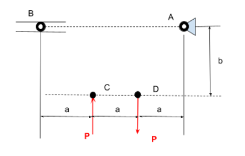

  <h1>A2 – Truss Stress Analysis</h1>

## Objective
Design a lightweight planar truss using A500 steel or an alternative material.

Create free body diagrams (FBDs) for joints and critical pins.

Calculate the required cross-sectional area of truss elements with a safety factor.

Determine pin sizes based on shear forces with a safety factor.

Solve equations symbolically and numerically for both truss and pin design.

Estimate the total weight of the truss and pins.

Create a CAD model with accurate dimensions and connections.

Compare CAD weight predictions with hand calculations.

Document key engineering lessons learned from the process.

## Analyze
#### Description
This project involves developing a complete engineering design and stress analysis of a lightweight planar truss. The analysis begins by interpreting the given loading, support and geometric constraints and using them to develop a stable and statically determinate truss geometry. Free body diagrams (FBDs) and equilibrium equations are utilized to determine support reactions and internal forces within each truss member. 

The calculated member forces will then be used to determine the required cross- sectional area of the truss. The connecting pins wall also be analyzed for shear. Both of these factors will be sized using their specific material properties and factors of safety. The analytical design is translated into a 3D CAD model, allowing the calculated weight to be compared with the mass  predicted by the CAD Software for comparison. 

Throughout the course of this project, I will be documenting every step of the design process, including sketches, calculations, design decisions, revisions, mistakes and observations. 

#### Design Constraints 
Cross sectional area of each element is to be identical. 

The pins are to be identical to each other and each element is to have the same cross-sectional geometry. 

Truss must remain stable and struturally sound under the applied loading. 

The design should minimize weight while satisfying the required safety factor. 

#### Force and Geometric Constrains

  

P = Choose a value between 20 - 30 kN 

a = 0.4m

b - 0.3m 

Point A = Pin 

Point B = Roller

## Decide
_Which geometry did you select, and why? This is your first open design choice in the course — defend it._

## Communicate

